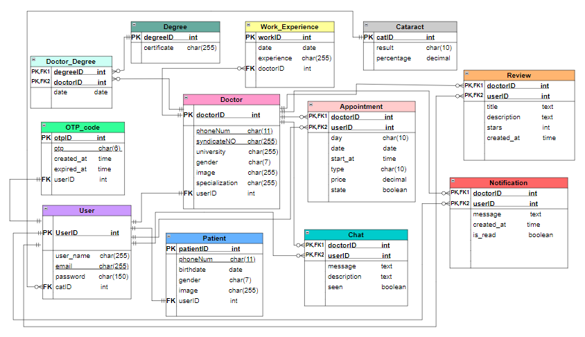

# SightSaver 
It is a ```REST API``` for a medical mobile application with an Artificial Intelligence model to detect cataract disease .The application facilitates communication between the 2 types of authenticated users -patients and doctors- through online reservation , payment , chat , and the availability for rating doctors. 

# Technologies / Tools   
- <span style="font-size:larger;">Programming Language : </span> Python 
- <span style="font-size:larger;">Backend Framework : </span> Django
- <span style="font-size:larger;">DataBase : </span> Sqlite for development & PostgreSQL for deployment
- <span style="font-size:larger;">Mail Service  : </span> Mailtrap for development & Gmail for deployment 
- <span style="font-size:larger;">Payment Service : </span> Stripe
- <span style="font-size:larger;">Testing & Documenting  : </span> Postman , Swagger
- <span style="font-size:larger;">Live Server : </span> Render

# Database Schema   



# Installation 
<span style="font-size:larger;">Note :  </span>The suitable python version is <span style="font-size:larger;"> 3.10.11 </span> 

1- clone the repo :  
```
git clone https://github.com/alyaaa7med/NewGraduationProject.git
```
2- install packages :
```
pip install -r requirements.txt 
```
# Usage
<span style="font-size:larger;">Note : </span>Do not forget to create your<span style="font-size:larger;"> .env </span> file inside the parent directory


1- Set your actual values for the environment    variables :

- ```SECRET_KEY:``` A secret key for your Django 
application. This should be a large random value.
- ```DEBUG:``` Set to True for development and False for production.
- ```DATABASE_URL:``` The URL of your PostgreSQL database (only required in deployment).
- ```EMAIL_HOST_USER:``` Your email service username (Mailtrap or Gmail).
- ```EMAIL_HOST_PASSWORD:``` Your email service password (Mailtrap or Gmail)..
- ```STRIPE_PUBLIC_KEY:``` Public key for integrating Stripe with your frontend.
- ```STRIPE_SECRET_KEY:``` Secret key for integrating Stripe with your backend.
- ```STRIPE_WEBHOOK_KEY:``` Webhook signing key for validating Stripe webhook events (key in development phase is different from the deployment one).


2- apply the migrations on your database :
```
python manage.py migrate 
```
<span style="font-size:larger;">Notes : </span>
- You can find the documentation for the endpoints locally on url ```localhost:[port_number]/api/docs```
- You can find this API  deployed on ```sightsaver.onrender.com```

# Contribution 
Any contributions will be greatly appreciated.

1. Fork the Project
2. Create and Switch to your Feature Branch: 
   ```git checkout -b NewFeature```
3. Stage your Changes ```git add -A ```
4. Commit your Changes: ```git commit -m "add some new features"```
5. Push to the Branch: ``` git push origin NewFeature```
6. Open a Pull Request


  

  
   
